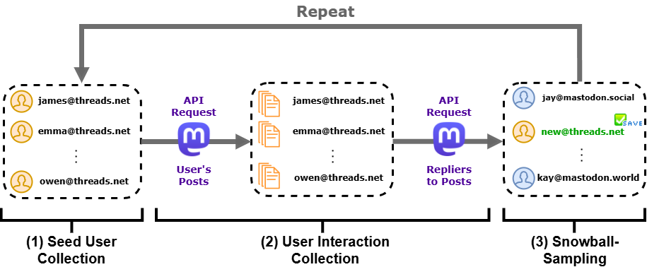

# Interaction-Driven Snowball Sampling (IDSS) for Threads Users via Mastodon API

## 📊 Overview

This repository implements **Interaction-Driven Snowball Sampling (IDSS)** to identify Threads users who have enabled **Fediverse Sharing**, using the **Mastodon API**. The process is anchored on the `mastodon.social` instance due to its broad federation with other servers.

The diagram below illustrates the IDSS workflow, which iteratively expands the dataset by tracing user interactions:



## 🛠️ Requirements

To use this pipeline, you need a **Mastodon API access token**. You can obtain one by registering an application on your Mastodon account. A helpful guide is available here:  
🔗 [How to Get a Mastodon API Token](https://martinheinz.dev/blog/86)

## 📁 Repository Contents

- `IDSS_pipeline.py`: Main script that implements the full IDSS process:
  - Seed user discovery using `@threads.net` profile search
  - Recursive expansion by tracking replies to seed user posts
  - Deduplication and interaction mapping

- `requirements.txt`: Lists all Python dependencies needed to run the pipeline.

## ⚙️ Installation

Install the required packages with:

```bash
pip install -r requirements.txt
python IDSS_pipeline.py

